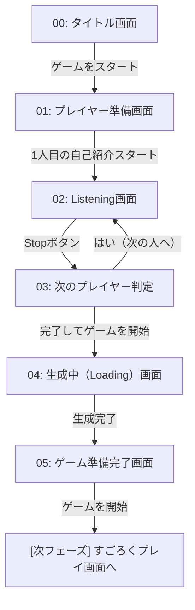

# LifeLoop — UI/UX & API連携 仕様書

> **プロジェクト名**: LifeLoop  
> **ドキュメント**: UI/UX & API Integration Specification  
> **フェーズ**: 画面遷移・バックエンド連携設計  

本仕様書は、LifeLoopのWeb App実装において、ユーザーの自己紹介からゲーム開始までの**画面遷移（Screen 00〜05）**および、それに伴う**バックエンド（Gemini API）のトリガータイミング**を定義するものです。

---

## 1. 画面遷移フロー (Screen Flow)

プレイヤーの自己紹介フェーズから盤面生成までのループ構造です。

---

## 2. 画面詳細とUI要素 (Screen Details & Actions)

各画面の必須UI要素と、ユーザーアクションに応じた挙動を定義します。

### 【00】タイトル画面
*   **用途**: アプリケーションのEntryPoint。
*   **UI要素**:
    *   タイトルロゴ (LifeLoop)
    *   **Button**: 「ゲームをスタート」
*   **アクション**: クリックで【01: タイトル画面/準備】へ遷移。

### 【01】プレイヤー準備画面
*   **用途**: 音声入力（マイク利用）の準備と同意。
*   **UI要素**:
    *   **Button**: 「1人目の自己紹介をスタート」
*   **アクション**: マイク権限をリクエストし、許可され次第【02: Listening】へ遷移。

### 【02】Listening 画面
*   **用途**: ユーザーが実際に自己紹介を喋る画面。Gemini Live APIによるリアルタイム解析の演出をここで行う。
*   **UI要素**:
    *   **テキスト**: 「Listening...」などの可視化（音声波形アニメーションやLive APIからの抽出キーワードが浮かび上がる演出があると望ましい）
    *   **Button**: 「Stop」
*   **アクション**: 「Stop」押下で音声入力を打ち切り、**【APIトリガー 1】**を発火させた上で【03: 次のプレイヤー判定】へ遷移。

### 【03】次のプレイヤー判定画面
*   **用途**: 複数人の自己紹介をループ処理するための分岐点。
*   **UI要素**:
    *   **テキスト**: 「次の方の自己紹介を始めますか？」
    *   **Button**: 「はい」 (Yes)
    *   **Button**: 「完了してゲームを開始」 (Finish)
*   **アクション**:
    *   「はい」押下: N人目の入力として【02: Listening】へループして戻る。
    *   「完了」押下: **【APIトリガー 2】**を発火させ、【04: 生成中】へ遷移。

### 【04】プロフィール・すごろく生成中（Loading）画面
*   **用途**: Text APIによる重いデータ（JSON等）の生成待機画面。
*   **UI要素**:
    *   **テキスト (Step 1)**: 「プロフィール作成中……。」
    *   **テキスト (Step 2)**: 「すごろく作成中……。」
    *   ローディングスピナーまたは進捗表示バー
*   **アクション**: バックエンドからのBoardSpec（盤面JSON）返却を待機。すべて受領したら【05: 生成完了】へ自動遷移。

### 【05】ゲーム準備完了画面
*   **用途**: プレイ開始前のデモ演出画面。「自分たちの入力がゲームになった」体験のハイライト。
*   **UI要素**:
    *   **テキスト**: 「ゲームが生成されました！」
    *   **テキスト**: 「（自動生成タイトル） クエスト」（例: "エンジニア深夜のピザ クエスト"）
    *   **Button**: 「ゲームを開始」
*   **アクション**: クリックですごろくプレイ画面（Canvas等）へ遷移し、Turn1を開始。

※ *Note: Nano Bananaによる背景画像・アイコン生成は、画面04〜05の裏側（非同期）で走らせ、ゲーム開始後に順次UIへ差し替える（Lazy Load）ことで画面ブロックを防ぎます。*

---

## 3. バックエンドAPIのトリガータイミング (Backend Integration)

システム側から見た「いつ、どのAPIを叩き、どう状態を更新するか」の設計です。

### 【APIトリガー 1】 プロフィール作成
*   **発火点**: 【02】画面で **「Stop」** ボタンが押下された瞬間。
*   **対象API**: BFFの `POST /api/generate/profile` (Gemini Text API) 
*   **処理フロー**:
    1.  画面02で録音した音声（またはLive APIの会話テキストログ）を確定データとしてBFFへ送信。
    2.  BFFにてText APIを呼び出し、その1人分の `PlayerProfile` (プロフィールJSON) を生成する。
    3.  フロントエンドはその結果を `Store` (Zustandのプレイヤー配列等) にPushする。
*   **UX注記**: APIのレスポンス完了を待たずに【03】の画面へ遷移してOK（非同期処理）。画面03でユーザーが迷っている裏でAPIリクエストを完了させておくことで体感速度を上げる。

### 【APIトリガー 2】 すごろく（Board）作成
*   **発火点**: 【03】画面で **「完了してゲームを開始」** ボタンが押下された瞬間。
*   **対象API**: BFFの `POST /api/generate/board` (Gemini Text API)
*   **処理フロー**:
    1.  直前までに蓄積された全参加者の `PlayerProfile` 配列を一括でBFFへ送信。
    2.  BFFにてText APIを呼び出し、全体テーマと盤面構成 `BoardSpec` (すごろくマスのJSON) を生成する。（この通信待機中が【04】Loading画面にあたる）
    3.  BFFから盤面JSONがフロントエンドに返却されたら、StoreにBoardをセットし【05】へ自動遷移。
    4.  **【Nano Banana 非同期発火】**: 盤面JSONが確定した直後（画面05表示時）に Nano Bananaの画像生成APIを非同期で叩き始める。

---

## 4. プロダクトオーナーとしての実装上のアドバイス (UX/Failsafe)

ハッカソンのデモ完走に向けた3点の追加実装要件です。

1. **API遅延によるステート破損の防止**:
   「Stop」押下時のプロフィール生成（トリガー1）が遅延し、次の人がすぐに「完了（トリガー2）」を押してしまった場合に備え、フロントエンドで `Promise.all`等を利用し「全員分のプロフィールJSON生成が完了してから Board API を叩く」よう同期・待機制御を挟んでください。
2. **タイムアウト時の即時フォールバック**:
   画面04（作成中）で Board 生成APIのレスポンスが **2.5秒** を超過した際は、エラーにせず**固定のテンプレ盤面（Fallback Board）**をStoreにセットして強制的に05へ遷移させてください。（デモ中の致命傷を防ぐ絶対ルール）
3. **動的タイトルの即時表示**:
   画面05で表示する「（自動生成タイトル） クエスト」の文字列は、BoardSpec JSONの中の `world.theme` などのプロパティをバインディングして表示させます。
