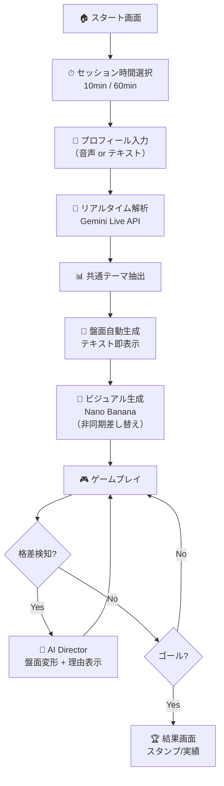
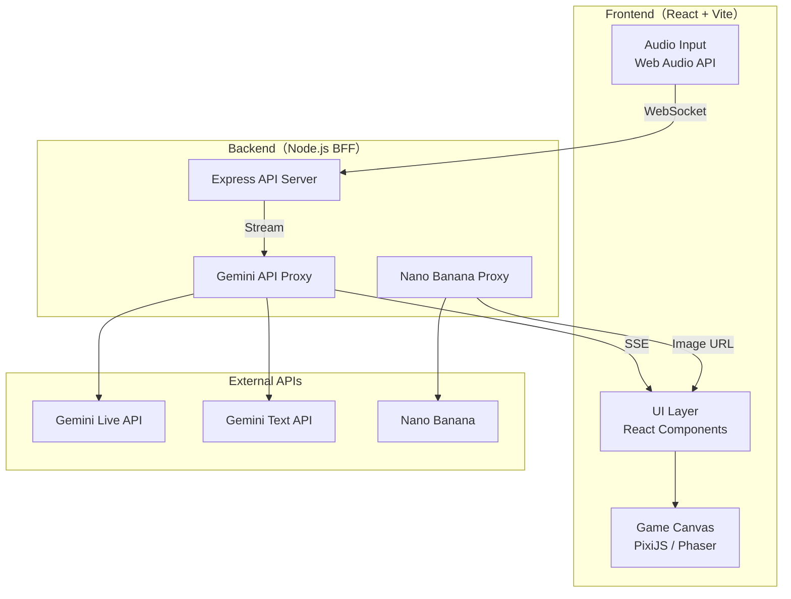
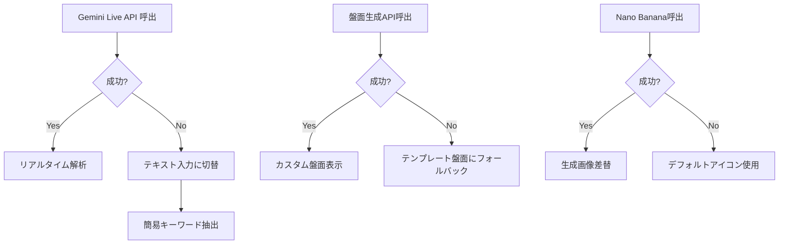

# LifeLoop — 要件定義書（PRD）

> **プロジェクト名**: LifeLoop  
> **イベント**: Cerebral Valley × Google DeepMind ハッカソン (2026-02-21)  
> **ドキュメント更新日**: 2026-02-21  
> **ステータス**: レビュー待ち

---

## 1. エグゼクティブサマリー

**LifeLoop** は、退屈な自己紹介を **リアルタイムAI生成のすごろくゲーム体験** に変換するWebアプリケーションである。

プレイヤーが音声で自己紹介すると、**Gemini Live API** がリアルタイムで解析し、参加者の共通テーマから世界観・盤面・イベントを自動生成。さらに **Nano Banana** で背景・アイコンをビジュアル生成し、**AI Director** がゲームバランスを動的に調整する。

> [!IMPORTANT]
> **3分デモで「自己紹介→盤面生成→1ターンプレイ→AI盤面変形」の一連を完走すること**が最優先目標。

---

## 2. プロダクトビジョン

### 2.1 ワンライナー

> プレイ時間を選ぶだけで、同じゲームが「10分＝アイスブレイク」「60分＝やり込み」に自動変形する2.5Dすごろく。

### 2.2 ターゲットユーザー

| セグメント | ユースケース |
|---|---|
| ハッカソン参加者 | 初対面チームのアイスブレイク |
| 企業イベント | チームビルディング・懇親会 |
| 学校・コミュニティ | 自己紹介ワークショップ |

### 2.3 差別化ポイント

- **自己紹介がそのままゲームになる** — 入力＝コンテンツ
- **リアルタイムAI解析の可視化** — 「AIが動いてる」驚き
- **毎回異なる盤面** — 参加者が変われば世界が変わる
- **AI Director** — ゲームバランスを動的に調整

---

## 3. ハッカソン制約 & DQ回避

### 3.1 必須技術

| 技術 | 用途 |
|---|---|
| **Gemini Live API** | リアルタイム音声解析・プロフィール抽出・イベント動的生成 |
| **Nano Banana** | 盤面背景画像・マスアイコン・キャラクタートークン生成 |

### 3.2 禁止事項チェック

| 禁止項目 | LifeLoopの該当判定 |
|---|---|
| 基本RAGアプリ | ❌ 非該当（ゲーム運営・盤面生成が核） |
| Streamlitアプリ | ❌ 非該当（React/Vite使用） |
| 画像分析ツール | ❌ 非該当（画像"生成"側） |
| 性格分析ツール | ❌ 非該当（性格タイプ判定はしない） |
| メンタルヘルス/医療 | ❌ 非該当 |
| 教育AIチャットボット | ❌ 非該当 |

### 3.3 DQ回避策

- アプリ内に **"Built at Hackathon"パネル** を表示し、以下の固定フィールドを見せる
  - GitHub リポジトリURL
  - 最新コミットSHA (HEAD)
  - ビルド日時
  - ハッカソン期間中に作成した主要モジュール一覧 (Frontend / BFF / Proxy / Game Engine)
  - 使用モデルID一覧 (Gemini 3 Live, Gemini 3 Flash, Gemini 3 Pro Image Preview)
- OSS/素材の **クレジット表示** (名称＋ライセンス種別を明記, 例: PixiJS - MIT License)
- Nano Bananaによる生成画像は **SynthIDウォーターマーク** を含むことを明記し、生成物の自前証明とする
- デモでは **ハッカソン期間中に作った機能のみ** を見せる導線

---

## 4. MVP定義（Public Demo Ready）

### 4.1 MVPの成立条件

> 審査の3分デモで **「リアルタイム解析→盤面生成→1ターン以上プレイ→AIによる変化」** が必ず成立する。

| 条件 | 詳細 |
|---|---|
| AT-1 | 10分セッションで一連が完走（失敗なく） |
| AT-2 | Live解析がUIにストリーミング表示される |
| AT-3 | 盤面が3秒以内にテキスト表示（画像は遅れてOK） |
| AT-4 | Nano Banana生成物が後から差し替わる |
| AT-5 | 盤面変形（救済/調整）が1回以上発生し理由が表示される |
| AT-6 | フォールバックでも1ターン遊べる |
| AT-7 | Proof/Creditsが画面から辿れる |

### 4.2 優先度分類

```
P0（絶対必要）
├── 10分セッション: Live抽出→盤面生成→1ターン→盤面変形1回
├── 背景画像1枚生成（Nano Banana）＋差し替え
├── フォールバック機構
└── Proof/Credits

P1（勝ちが太くなる）
├── 60分セッションの3幕構造（Act1/2/Final）
├── A/B選択肢（60分セッション）
├── Perk 1系統（効果実装）
└── スタンプ帳UI

P2（余裕があれば）
├── 複数Perk系統
├── アチーブメント拡充
└── Cosmetic Unlock
```

---

## 5. 機能要件（Functional Requirements）

### FR-0 セッション時間選択

| 項目 | 10分セッション | 60分セッション |
|---|---|---|
| AI会話（Intro） | 60秒（合計） | 300秒（合計） |
| 盤面マス数 | 8〜12（推奨10） | 18〜26（推奨22） |
| イベント文 | 短文（1文） | 1〜3文＋選択肢A/B |
| サブクエスト | 0〜1 | 2〜4 |
| バランス調整 | デモで1回は必ず発火 | 自然に複数回発火 |
| メタ進行 | 獲得表示のみ | 効果が実際に反映 |

> [!TIP]
> 3分デモは **10分設定で実行** しつつ、メタ画面で60分の深さを一瞬見せる（「1回芸」回避）。

---

### FR-1 プロフィール入力

| ID | 要件 | 優先度 |
|---|---|---|
| FR-1.1 | 音声またはテキストによる自己紹介を受け付ける | P0 |
| FR-1.2 | 複数人分を連続で入力可能 | P0 |
| FR-1.3 | セッション時間に応じて会話時間が変わる | P0 |

---

### FR-2 リアルタイム解析（Gemini Live API）

| ID | 要件 | 優先度 |
|---|---|---|
| FR-2.1 | 自己紹介入力中にストリーミング解析を行う（UI可視化） | P0 |
| FR-2.2 | 趣味・関心、ライフスタイル、属性・志向を抽出 | P0 |
| FR-2.3 | 複数人の共通テーマを自動抽出 | P0 |
| FR-2.4 | 禁止領域回避（性格診断/医療/メンタルアドバイスをしない） | P0 |

---

### FR-3 すごろく自動生成（BoardSpec）

| ID | 要件 | 優先度 |
|---|---|---|
| FR-3.1 | 共通テーマ → 世界観（テーマ）を生成 | P0 |
| FR-3.2 | 盤面構造を生成（10分=8〜12 / 60分=18〜26） | P0 |
| FR-3.3 | 各マスのイベント内容（テキスト）を生成 | P0 |
| FR-3.4 | Nano Bananaで背景画像・マスアイコン生成（非同期差し替え） | P0 |
| FR-3.5 | まずテキスト盤面を即表示 → 画像は後から差し替え | P0 |

---

### FR-4 ゲーム進行

| ID | 要件 | 優先度 |
|---|---|---|
| FR-4.1 | サイコロ操作（UIボタン） | P0 |
| FR-4.2 | プレイヤーのコマ移動（簡易アニメ） | P0 |
| FR-4.3 | マス到達時にイベント表示 | P0 |
| FR-4.4 | イベント文はGeminiで動的生成 | P0 |
| FR-4.5 | 60分セッション: イベントに選択肢A/Bを含む | P1 |

---

### FR-5 デモ演出切り替え

| ID | 要件 | 優先度 |
|---|---|---|
| FR-5.1 | 自己紹介画面→ゲーム画面へ即時切り替え | P0 |
| FR-5.2 | 生成処理の進行をUIで可視化（進捗/ログ/ステップ） | P0 |

---

### FR-6 バランス調整（AI Director）

| ID | 要件 | 優先度 |
|---|---|---|
| FR-6.1 | プレイヤー間の格差を検知（先頭-最下位距離） | P0 |
| FR-6.2 | 救済マス出現・効果調整・イベント入替を実施 | P0 |
| FR-6.3 | 変更理由をAI Director Panelに1文で表示 | P0 |
| FR-6.4 | **【デモ確約トリガー】** 10分セッション: デモ中に必ず1回発火。Turn=1終了後に必ず1回だけ救済イベントを挿入し、Rebalance理由を表示する。 | P0 |

---

### FR-7 やり込み共通基盤

| ID | 要件 | 優先度 |
|---|---|---|
| FR-7.1 | Stamp（収集）: マス種別スタンプが貯まる | P1 |
| FR-7.2 | Achievement（実績）: 2〜3個はMVPで実装 | P1 |
| FR-7.3 | Perk（成長）: 10分=XP表示のみ / 60分=効果反映 | P1 |
| FR-7.4 | Cosmetic Unlock: 見た目解放（Nano Banana活用） | P2 |

---

### FR-8 DQ回避（Proof & Credits）

| ID | 要件 | 優先度 |
|---|---|---|
| FR-8.1 | "Built at Hackathon"表示（項目固定：URL, HEAD, 日時, モジュール一覧, 使用モデル） | P0 |
| FR-8.2 | OSS/素材のクレジット表示（ライセンス種別を明記）および SynthIDウォーターマークの言及 | P0 |
| FR-8.3 | デモでは自分達が作った機能のみを見せる導線 | P0 |

---

## 6. 非機能要件（NFR）

### NFR-1 レイテンシとタイムアウト

| ID | 要件 | 目標値・フォールバック条件 |
|---|---|---|
| NFR-1.1 | 共通テーマ抽出〜テキスト盤面表示 | **3秒以内** |
| NFR-1.2 | BoardSpec生成タイムアウト | **2.5秒** を超過した場合は、即座にテンプレ盤面（固定8〜12マス）を表示 |
| NFR-1.3 | 画像生成待ちは許容（進捗可視化必須） | N秒で間に合わなければデフォルトアイコンに固定 |

### NFR-2 デモ安定性（フォールバック閾値）

| ID | 要件 |
|---|---|
| NFR-2.1 | 生成失敗時: テンプレート盤面（8〜12マス固定の定義）へフォールバック |
| NFR-2.2 | ネットワーク断線時: ローカルイベントDBに**最低20件**のイベントを保持し、オフラインでも1ターン成立させる |
| NFR-2.3 | Live API切替条件: WS接続失敗、5秒無音、3秒無応答のいずれかでテキスト入力・テキスト抽出へ即切替 |

### NFR-3 視認性

| ID | 要件 |
|---|---|
| NFR-3.1 | 「AIが今動いてる」が一目で分かるUI |
| NFR-3.2 | 審査員が離れて見ても盤面が理解できる（大きめフォント・少なめテキスト） |

### NFR-4 公開可能性・プライバシー

| ID | 要件 |
|---|---|
| NFR-4.1 | APIキー/秘密情報はリポジトリに含めない（`.env`） |
| NFR-4.2 | 権利不明素材を含めない |
| NFR-4.3 | 音声/会話ログは **メモリ上でのみ保持** し、セッション終了時に即破棄（永続保存しない）。 |
| NFR-4.4 | サーバログに音声データや全文テキストを残さない（必要であれば利用メトリクスのみ記録）。 |
| NFR-4.5 | デモ録画やプレイ画面開始時に、マイク利用の同意およびデータの一時利用について明記する。 |

### NFR-5 レート制限・コスト設計

| ID | 要件 |
|---|---|
| NFR-5.1 | 10分セッションにおける Nano Banana の呼び出し上限を設ける（背景1枚＋アイコン各種で最大N枚とし、例：最初は3種のみ生成）。 |
| NFR-5.2 | 60分セッションでは、画像を後からLazy Load/生成し、初手は最小アセット＋テキストのみで進行してAPI制限の枯渇を防ぐ。 |

---

## 7. ユーザーフロー



---

## 8. 画面構成

### 8.1 画面一覧

| # | 画面名 | 概要 |
|---|---|---|
| S1 | **スタート画面** | ロゴ・セッション時間選択・参加人数入力 |
| S2 | **プロフィール入力画面** | 音声入力UI・リアルタイム解析可視化・プロフィールカード |
| S3 | **盤面生成演出画面** | 生成ステップ表示（LISTEN→EXTRACT→THEME→BOARD→ART→READY） |
| S4 | **ゲーム画面** | 2.5D盤面・サイコロ・コマ・イベントパネル・AI Directorパネル |
| S5 | **結果画面** | スコア・スタンプ・実績 |
| S6 | **Proof/Credits画面** | ビルド情報・ライセンス |

### 8.2 主要UIコンポーネント

#### ゲーム画面レイアウト

```
┌─────────────────────────────────────────────────┐
│                   ヘッダー                        │
├──────────────────────────────────┬──────────────┤
│                                  │ AI Director  │
│        2.5D すごろく盤面          │   Panel      │
│        （Canvas / WebGL）        │ ┌──────────┐ │
│                                  │ │ステップ   │ │
│    ◉ P1    ◉ P2                  │ │進捗       │ │
│      ▼                          │ │Rebalance  │ │
│    [マス] → [マス] → [マス]      │ │理由       │ │
│                                  │ └──────────┘ │
├──────────────────────────────────┴──────────────┤
│  🎲 サイコロ  │ イベントパネル  │ プレイヤー情報  │
└─────────────────────────────────────────────────┘
```

---

## 9. データモデル

### 9.1 SessionConfig

```typescript
interface SessionConfig {
  sessionMinutes: 10 | 60;
  introTalkSeconds: number;     // 60 | 300
  boardTiles: number;           // 8-12 | 18-26
  eventVerbosity: "short" | "rich";
  sideQuests: number;           // 0-1 | 2-4
  rebalanceAggressiveness: "low" | "high";
}
```

### 9.2 PlayerProfile

```typescript
interface PlayerProfile {
  id: string;
  displayName: string;
  tags: string[];               // 趣味・関心
  lifestyle: string[];          // 夜型, 朝型 etc.
  attributes: string[];         // 学生, エンジニア etc.
  quote: string;                // 本人発言由来の短い引用
  avatarPrompt: string;         // Nano Banana用プロンプト
  avatarUrl?: string;           // 生成後に差し替え
  color: string;                // プレイヤーカラー
}
```

### 9.3 BoardSpec / TileSpec

```typescript
interface BoardSpec {
  world: {
    theme: string;              // 例: "宇宙エンジニアの冒険"
    tone: string;               // 例: "ユーモラス"
    artStylePrompt: string;     // Nano Banana背景用
  };
  tiles: TileSpec[];
  backgroundUrl?: string;       // 生成後に差し替え
}

interface TileSpec {
  id: number;
  title: string;
  type: "normal" | "bonus" | "penalty" | "event" | "rescue" | "goal";
  eventSeed: string;            // イベント生成のシード文
  effect: TileEffect;
  iconPrompt: string;           // Nano Banana用
  iconUrl?: string;             // 生成後に差し替え
}

interface TileEffect {
  type: "advance" | "retreat" | "score" | "swap" | "choice" | "none";
  value: number;
}
```

### 9.4 GameState

```typescript
interface GameState {
  sessionConfig: SessionConfig;
  players: PlayerState[];
  currentPlayerIndex: number;
  board: BoardSpec;
  turn: number;
  aiDirectorLog: DirectorAction[];
}

interface PlayerState {
  profile: PlayerProfile;
  position: number;
  score: number;
  stamps: Record<string, number>;
  achievements: Record<string, Date>;
  perkXp: Record<string, number>;
}

interface DirectorAction {
  turn: number;
  reason: string;
  action: string;               // 例: "救済マス出現"
  affectedTiles: number[];
}
```

### 9.5 MetaProgress

```typescript
interface MetaProgress {
  stamps: Record<string, number>;
  achievements: Record<string, string>;   // id → unlockedAt
  perkXp: Record<string, number>;
  unlocks: Record<string, string>;        // skinId → unlockedAt
}
// 保存先: localStorage（MVP）
```

---

## 10. システムアーキテクチャ



### 10.1 技術スタックと認証設計

**認証・接続方針（APIキー隠蔽）**:
ブラウザ（Frontend） ⇄ BFF（WebSocket等） ⇄ Gemini Live API / Nano Banana
- **設計制約**: **「APIキーはサーバ側のみに配置し、フロントエンド環境には絶対に埋め込まない」**。デモ時のDevTools調査等に耐えうる完全な隠蔽を保証する。

| レイヤー | 技術 | 理由 |
|---|---|---|
| Frontend | **React + Vite + TypeScript** | 高速開発・HMR・型安全 |
| ゲーム描画 | **PixiJS** | 2.5D描画に最適・軽量 |
| Backend | **Node.js + Express （BFF）** | APIキー完全隠蔽・API間プロキシ |
| 通信 | **WebSocket + SSE** | リアルタイムストリーミング |
| 状態管理 | **Zustand** | 軽量・シンプル |
| スタイリング | **Vanilla CSS** | 柔軟性・制御 |
| データ永続化 | **localStorage** | MVP向け最小構成 |

---

## 11. AI統合仕様

### 11.1 Gemini Live API（FR-1, FR-2）

**用途**: リアルタイム音声解析・プロフィール抽出・途中経過の可視化

```
入力フォーマット: 音声ストリーム（16-bit PCM / 16kHz / mono 必須）
出力: テキストストリーム（WebSocket経由）

設計上の注意点（ストリーム順序とJSON制約）:
- **順序保証の欠如**: 入力音声の文字起こし（transcription）とモデル応答（server content）は別ストリームで返されるため、UI側で遅延許容してマージ表示する。
- **構造化JSONの非保証**: Live APIのWebSocketは generationConfig で responseSchema / responseMimeType をサポートしないため、確定的なJSON生成には使えない。
- **方針**: Live APIは「キーワードや候補タグのストリーミング（可視化）」専用とする。確定した PlayerProfile や BoardSpec JSON の生成は、後続のGemini Text APIで行う。
```

### 11.2 Gemini Text API（FR-3, FR-4, FR-6）

**用途**: プロフィール確定JSONの生成・盤面生成・イベント動的生成・AI Director
**重要設定**: 全面的に `response_mime_type="application/json"` と `response_schema` を適用し、決定論的に構造化JSONを取得する。

```
確定プロフィール生成プロンプト (PlayerProfile):
- 入力: Live APIの会話ログや抽出キーワード
- 出力: PlayerProfile JSON

盤面生成プロンプト (BoardSpec):
- 入力: 共通テーマ、参加者プロフィール、セッション設定
- 出力: BoardSpec JSON（世界観 + マス定義）

イベント生成プロンプト:
- 入力: CurrentTile, PlayerProfile, GameContext
- 出力: イベントテキスト + 効果

AI Director プロンプト (DirectorAction):
- 入力: GameState（全プレイヤー位置・スコア）
- 出力: DirectorAction JSON（調整理由 + アクション）
```

### 11.3 Nano Banana（FR-3.4）

**用途**: ビジュアル生成

```
生成対象:
1. 盤面背景画像（1枚、最優先）
2. マスアイコン（タイル種別ごと）
3. キャラクタートークン（プレイヤーごと）

生成戦略:
- テキスト盤面表示後に非同期で生成開始
- 生成完了次第UIに差し替え（プログレッシブ）
- 失敗時はデフォルトアイコンにフォールバック
```

### 11.4 API・モデルマトリクス

| 機能 | 使うAPI | モデルID | 入出力 | 制約・フォールバック |
|---|---|---|---|---|
| **音声対話・抽出** | Gemini Live API | `gemini-3-live` | [入] 16-bit PCM/16kHz/mono<br>[出] WS Stream | Live API失敗時はテキスト入力画面へ切替 |
| **JSON生成全体** | Gemini Text API | `gemini-3-flash`（速度優先） | [入] テキスト<br>[出] JSON (Schema制約) | 生成タイムアウト(2.5s)でテンプレ盤面へ |
| **画像生成** | Nano Banana | `gemini-3-pro-image-preview`（高品質固定）| [入] 英語テキスト<br>[出] SynthID入画像 | N秒タイムアウトでデフォルト画像へ固定 |

### 11.5 プロンプト仕様と制約

**System Instruction（全機能共通）**:
- 「性格タイプ判定をしない / 医療・メンタル助言をしない / 個人の機微情報を推測しない」を絶対ルールとする。

**Live API用（途中経過可視化用）**:
- 画面にそのまま出力して良い粒度（「趣味タグの候補」「共通テーマの断片」等）に限定し、断定的な出力を避ける。

**Text API用（確定JSON制約）**:
- **PlayerProfile Schema**: `tags` 配列長は最大5、文字列は各20文字以内とする。
- **BoardSpec Schema**: タイル数はセッション設定に必ず合致させ、個別イベントテキストは最大40文字とする。また禁止語（医療用語、性格診断用語）を含めない。
- **DirectorAction Schema**: Rebalance理由はUI表示の都合上、最大1文（30文字以内）とする。

---

## 12. "AIが動いてる" 可視化（審査アピール）

### AI Director Panel（ゲーム画面右側）

| 表示要素 | 内容 |
|---|---|
| 現在ステップ | `LISTEN → EXTRACT → THEME → BOARD → ART → READY` |
| 進捗表示 | `icons 3/10` のような進捗 |
| Rebalance理由 | 1行テキスト（例:「Player Bが遅れています→救済マス出現」） |
| ストリーミングログ | AI出力のリアルタイム表示（タイプライター演出） |

---

## 13. フォールバック戦略



---

## 14. デモ台本（3分）

| 時間 | アクション | 審査ポイント |
|---|---|---|
| 0:00 | セッション時間「10分」を選択 | UIの明快さ |
| 0:05 | 30〜60秒間音声で自己紹介 → プロフィールカードがリアルタイム生成 | **Live API統合** |
| 0:40 | "Generate"ボタン → 3秒でテキスト盤面出現 | **レスポンス速度** |
| 0:50 | 背景画像が生成されて差し替わる | **Nano Banana統合** |
| 1:10 | サイコロを振る → コマ移動 → イベント表示 | **ゲームプレイ** |
| 1:40 | 格差検知 → 盤面変形 → AI Director理由ログ | **AI Director** |
| 2:10 | スタンプ/実績UIを一瞬見せる | やり込み可能性 |
| 2:30 | Proof/Creditsパネルを表示 | DQ対策 |
| 3:00 | 終了 | — |

---

## 15. 過去のGemini 3ハッカソン受賞作品からの教訓

### 参考プロジェクト（London, Dec 2025）

| プロジェクト | 概要 | LifeLoopへの示唆 |
|---|---|---|
| マルチモーダルAIオンボーディング | Gemini 3 + Nano Banana Proで没入型オンボーディング動画生成 | Nano Bananaの動的ビジュアル生成は高評価 |
| Mr. Keating（AR AI家庭教師） | ARベースのパーソナライズド学習 | リアルタイム性・パーソナライズが重要 |
| 地図＆ランドマーク生成 | ユーザー入力から地図と没入型画像を生成 | ユーザー入力→ビジュアル生成のフローは効果的 |
| 文学→ナラティブエンジン | 静的文学をビジュアル＆会話型体験に変換 | テキスト→インタラクティブ体験の変換は評価される |

### 優勝のための重要ポイント

1. **「動いてる」が伝わること** — リアルタイム性の可視化が最重要（デモ配点50%）
2. **Nano Bananaの活用** — 単なるテキスト出力ではなく、AI生成ビジュアルを見せる
3. **インタラクティブ性** — 審査員が実際に触れる・反応するデモ
4. **技術的深さ** — Live API + Nano Banana + AI Directorの3層構造で差別化

---

## 16. 審査基準対応マッピング

| 審査基準 | 配点 | LifeLoopの対応 |
|---|---|---|
| **デモ** | 50% | リアルタイム解析→盤面生成→プレイが一連で動作。AI可視化で「動いてる驚き」 |
| **インパクト** | 25% | ハッカソン・企業イベント・学校など汎用性高い。自己紹介の根本変革 |
| **創造性** | 15% | 自己紹介→ゲーム変換は独自コンセプト。AI Directorによる動的バランス調整 |
| **ピッチ** | 10% | 3分台本で「自己紹介がそのままゲームになる」のワンメッセージ |

---

## 17. リスクと対策

| リスク | 影響度 | 対策 |
|---|---|---|
| Gemini Live APIが不安定 | 高 | テキスト入力フォールバック |
| Nano Banana生成が遅い | 中 | テキスト盤面先行表示＋非同期差し替え |
| デモ中にネットワーク断 | 高 | テンプレート盤面＋ローカルイベントDB |
| 盤面が視覚的に地味 | 中 | CSSアニメーション＋パーティクルエフェクト |
| 3分に収まらない | 高 | 台本リハーサル必須・各ステップにタイマー |

---

## 18. 用語集

| 用語 | 定義 |
|---|---|
| **LifeLoop** | 本プロジェクト名 |
| **すごろく** | 日本語で「board game」のジャンル名 |
| **AI Director** | ゲーム進行中にバランスを動的に調整するAIシステム |
| **BoardSpec** | 盤面構造の定義オブジェクト |
| **TileSpec** | 各マスの定義オブジェクト |
| **Nano Banana** | Google提供の画像生成AI |
| **Gemini Live API** | Google提供のリアルタイムAI会話API |
| **フォールバック** | 障害時の代替動作 |
| **セッション時間スケーリング** | 10分/60分でゲーム規模が自動調整される仕組み |
